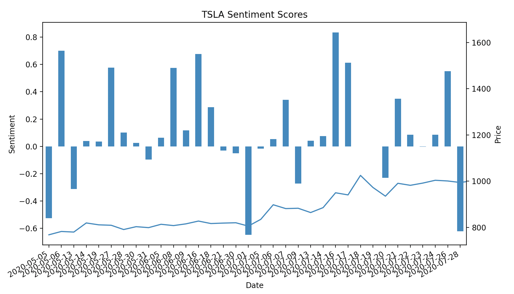

# WSB Sentiment Analysis

Note: This plot does not display the right TSLA price.

## Idea

I scraped posts and comments with stock ticker information from r/wallstreetbets. I used this data to perform sentiment analysis on each submission to get an average sentiment for a stock at various timeframes. I matched this up with stock/option movements to try to infer future movements.

## Todo

* Refactor code
  * Any subreddit
  * Write as script and save df to output directory
* Try inference based on WSB
